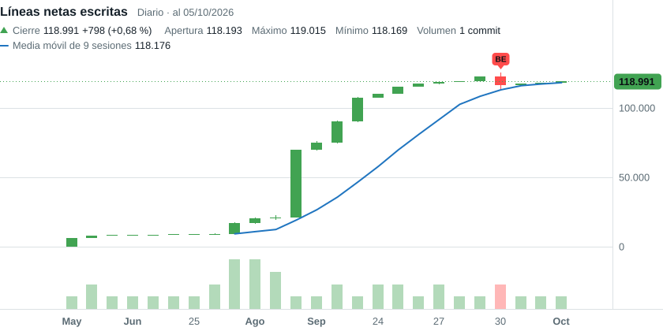

### Hola, soy Tiziano 👋

Construyo sistemas distribuidos y webs. Gestiono su ciclo de vida priorizando arquitecturas limpias y métricas de calidad.

---

<picture>
  <source media="(prefers-color-scheme: dark)" srcset="charts/ticker-dark.svg">
  <source media="(prefers-color-scheme: light)" srcset="charts/ticker-light.svg">
  
</picture>

<b>Cómo se lee</b>

Lo escrito se modela como un **stock de capital**: cada sesión invierte (líneas agregadas) y amortiza (líneas borradas).

$$K_t = K_{t-1} + I_t - D_t$$

| Campo | Definición |
|---|---|
| **Apertura** | $K_{t-1}$, las líneas netas al cierre de la sesión anterior |
| **Máximo** | $K_{t-1} + I_t$, la inversión bruta: líneas agregadas |
| **Mínimo** | $K_{t-1} - D_t$, la amortización: líneas borradas |
| **Cierre** | $K_t$, las líneas netas al final de la sesión |
| **Volumen** | Commits de la sesión |
| **Media móvil** | Media simple de los últimos 9 cierres |

- **Sesión:** un día con commits. Los días sin commits son *mercado cerrado* y no se dibujan, como un fin de semana bursátil. Con más de 90 sesiones, el gráfico pasa a velas semanales.
- **Dirección:** cada vela abre donde cerró la anterior. Si sube, las líneas netas crecieron; si baja, se borró más de lo que se escribió, que es una refactorización. El rango de la vela mide cuánto se movió el texto, independientemente del resultado neto.
- **Patrones:** se usan los umbrales del indicador de patrones de TradingView. `D` es un doji, con un cuerpo de 5 % del rango o menos: una sesión de reestructuración. `BE` es una vela envolvente, alcista debajo de la vela y bajista encima.
- **Universo:** commits propios, sin merges, en la rama principal de cada repositorio en el que participo, público o privado. Solo se publican totales diarios, sin nombres de repositorio ni SHAs.
- **Qué cuenta:** código fuente y documentación escrita (Markdown, MDX, reStructuredText y AsciiDoc). Quedan afuera los datos, las imágenes, los lockfiles, el código generado y las dependencias de terceros (`vendor/`, `node_modules/`, `dist/`).

